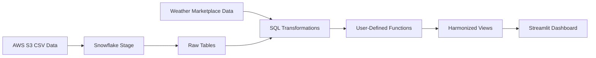

# Snowflake Tasty Bytes Data Engineering Pipeline

An end-to-end Snowflake data engineering project using AWS S3, SQL, Snowflake Marketplace weather data, user-defined functions, Python and Streamlit.

## Project Overview

This project follows an Ingestion–Transformation–Delivery architecture.

Transactional Tasty Bytes data was loaded from an external Amazon S3 source into Snowflake. The data was transformed using SQL and combined with historical weather data for Hamburg, Germany. The final analytical dataset was displayed through a native Streamlit application inside Snowflake.

## Architecture



## Project Stages

### Ingestion

- Configured an external Snowflake stage.
- Loaded CSV records from Amazon S3.
- Used `COPY INTO` to populate relational tables.
- Verified the imported data.

### Transformation

- Analysed Hamburg sales data.
- Combined sales and weather information.
- Created SQL views.
- Created Fahrenheit-to-Celsius and inches-to-millimetres functions.
- Produced an analysis-ready dataset.

### Delivery

- Created a Python Streamlit application inside Snowflake.
- Connected the application to the transformed data.
- Displayed sales and weather analytics.

## Technologies

- Snowflake
- SQL
- AWS S3
- Snowflake Marketplace
- Python
- Streamlit
- GitHub

## Repository Structure

```text
.
├── sql
│   ├── D-E1.1.sql
│   ├── D-E1.2.sql
│   ├── D-E2.1.sql
│   ├── D-E2.2.sql
│   ├── D-E2.3.sql
│   └── D-E_COMP.sql
├── app
│   └── HAMBURG_GERMANY_TRENDS.py
└── screenshots
    ├── streamlit-dashboard.png
    ├── hamburg-analysis.png
    ├── snowflake-workspace.png
    └── validation-result.png
```

## Execution Order

```text
1. D-E1.1.sql
2. D-E1.2.sql
3. D-E2.1.sql
4. D-E2.2.sql
5. D-E2.3.sql
6. D-E_COMP.sql
7. HAMBURG_GERMANY_TRENDS.py
```

## Project Evidence

### Streamlit Dashboard


### Hamburg Analysis


### Snowflake Workspace


### Validation Result


## Skills Demonstrated

- Cloud data ingestion
- SQL transformations
- External stages
- `COPY INTO`
- User-defined functions
- Data integration
- Streamlit application development
- Data validation
- Technical documentation

## Project Context

This project was completed in a Snowflake learning environment using the fictional Tasty Bytes dataset. This repository documents my completed implementation, code and results.
