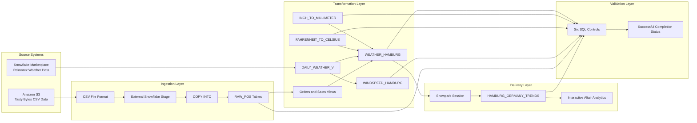
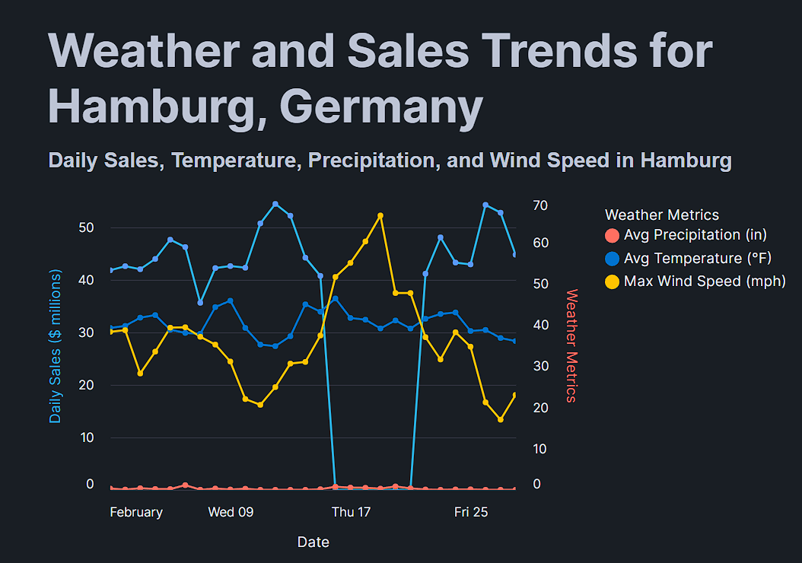
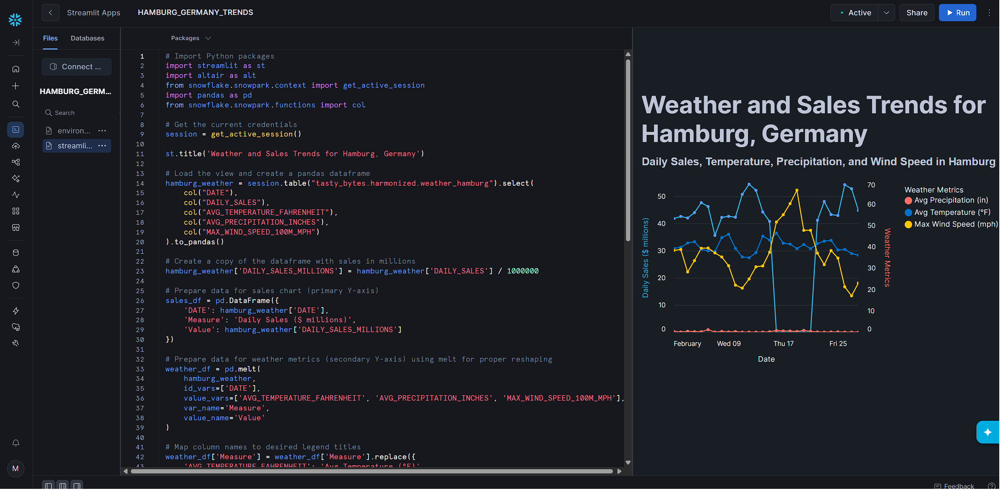
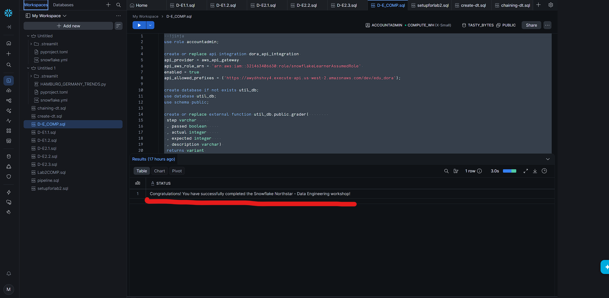
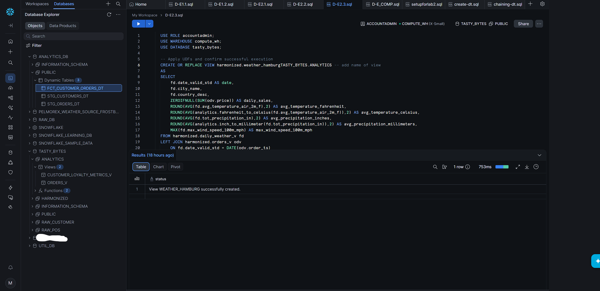

# Snowflake End-to-End Data Engineering Pipeline

<p align="center">
  
  
  
  
  
</p>

<p align="center">
  <strong>
    An end-to-end Snowflake data pipeline that ingests transactional data from AWS S3,
    integrates live Marketplace weather data, creates reusable transformation logic
    and delivers interactive analytics through Streamlit in Snowflake.
  </strong>
</p>

<p align="center">
  Cloud ingestion • SQL transformation • Data integration • UDFs • Analytics delivery • Automated validation
</p>

---

## Executive Summary

This project implements a complete **Ingestion–Transformation–Delivery data engineering workflow** inside Snowflake.

The pipeline begins by loading Tasty Bytes transactional data from an external Amazon S3 location. It then integrates that operational data with historical weather information from Snowflake Marketplace, builds reusable SQL views and user-defined functions, and produces a harmonised analytical dataset focused on Hamburg, Germany.

The final data product is consumed by a native Streamlit application running inside Snowflake. The application uses Snowpark, pandas and Altair to present daily sales alongside temperature, precipitation and wind-speed measurements in an interactive visualisation.

The implementation concludes with an automated validation framework that checks the database, ingested records, analytical views, conversion functions and Streamlit application.

> [!IMPORTANT]
> The completed project passed all supplied validation controls and returned:
>
> **Congratulations! You have successfully completed the Snowflake Northstar - Data Engineering workshop!**

---

## Recruiter Snapshot

| Engineering Area | Implementation |
|---|---|
| Cloud platform | Snowflake |
| Source ingestion | External Amazon S3 stage |
| File format | CSV |
| Loading pattern | `COPY INTO` |
| Transactional dataset | Tasty Bytes food-truck operations |
| External enrichment | Pelmorex weather data through Snowflake Marketplace |
| Transformation language | SQL |
| Reusable logic | Snowflake user-defined functions |
| Analytical modelling | Raw, harmonised and analytics-layer objects |
| Delivery application | Streamlit in Snowflake |
| Visualisation | Altair interactive layered chart |
| Application data access | Snowpark active session |
| Validation | Six-object SQL control framework |
| Final result | All required pipeline components validated successfully |

---

## Business Problem

Operational sales data rarely provides enough context on its own.

A food-truck operator may know that sales declined or reached zero on particular days, but the transaction records alone do not explain what external conditions may have contributed to that outcome.

This project investigates a practical analytical question:

> **Could unusual weather conditions help explain interrupted food-truck sales in Hamburg during February 2022?**

Answering that question required combining two different data domains:

```text
Transactional sales data
        +
Historical weather data
        ↓
Context-rich analytical dataset
```

The completed data product supports analysis of:

- Daily food-truck sales
- Average air temperature
- Precipitation
- Maximum wind speed
- Dates with missing or zero sales
- Weather patterns occurring around those dates

The observed relationship is treated as an analytical correlation, not proof that weather alone caused the sales interruption.

---

# Architecture



---

## End-to-End Data Flow

```text
Tasty Bytes CSV files in Amazon S3
                    ↓
Snowflake CSV file format and external stage
                    ↓
COPY INTO raw relational tables
                    ↓
Full transactional dataset and analytical views
                    ↓
Pelmorex historical weather from Marketplace
                    ↓
Hamburg sales, temperature and wind analysis
                    ↓
Metric-conversion user-defined functions
                    ↓
Harmonised WEATHER_HAMBURG analytical view
                    ↓
Snowpark + pandas + Altair
                    ↓
Native Streamlit analytics application
                    ↓
Automated SQL validation
```

---

# Implementation

## 1. Cloud Data Ingestion

The ingestion layer provisions the primary Snowflake database and the objects required to load structured CSV data from Amazon S3.

### Core objects

```text
Database: TASTY_BYTES
Schema:   TASTY_BYTES.RAW_POS
Format:   TASTY_BYTES.PUBLIC.CSV_FF
Stage:    TASTY_BYTES.PUBLIC.S3LOAD
```

### External stage

The Snowflake stage points to the Tasty Bytes education dataset stored in Amazon S3:

```sql
CREATE OR REPLACE STAGE tasty_bytes.public.s3load
URL = 's3://sfquickstarts/tasty-bytes-builder-education/'
FILE_FORMAT = tasty_bytes.public.csv_ff;
```

### Initial load

The first ingestion script creates the `COUNTRY` table and loads its records using:

```sql
COPY INTO tasty_bytes.raw_pos.country
FROM @tasty_bytes.public.s3load/raw_pos/country/;
```

This initial load is later validated against an expected total of:

```text
30 country records
```

### Why use an external stage?

An external stage separates the source location from the transformation logic.

This provides a reusable ingestion boundary between:

```text
Cloud object storage
        ↓
Snowflake loading operations
        ↓
Relational destination tables
```

### Ingestion scripts

```text
snowflake-tasty-bytes-data-pipeline/sql/D-E1.1.sql
snowflake-tasty-bytes-data-pipeline/sql/D-E1.2.sql
```

---

## 2. Transactional Data Environment

The extended ingestion script provisions the larger Tasty Bytes environment used by the transformation layer.

The resulting data model supports operational entities such as:

- Countries and cities
- Trucks
- Menus
- Customers
- Orders
- Order details
- Location and franchise information

The purpose of this stage is not simply to copy files. It creates the relational foundation required for repeatable analytical queries and downstream application development.

### Engineering flow

```text
Source CSV files
      ↓
Schema-aligned Snowflake tables
      ↓
Relational operational model
      ↓
Reusable analytical views
```

---

## 3. Hamburg Sales Investigation

The transformation workflow generates every date in February 2022 and left-joins those dates to Hamburg order records.

This design is important because it preserves days where no matching sales records exist.

```sql
WITH _feb_date_dim AS (
    SELECT DATEADD(DAY, SEQ4(), '2022-02-01') AS date
    FROM TABLE(GENERATOR(ROWCOUNT => 28))
)
SELECT
    fdd.date,
    ZEROIFNULL(SUM(o.price)) AS daily_sales
FROM _feb_date_dim fdd
LEFT JOIN analytics.orders_v o
    ON fdd.date = DATE(o.order_ts)
    AND o.country = 'Germany'
    AND o.primary_city = 'Hamburg'
GROUP BY fdd.date;
```

### Why generate a complete date series?

Querying only the order table would omit dates with no transactions.

Generating the full February calendar allows the analysis to distinguish between:

```text
A day with low sales
```

and:

```text
A day with no recorded sales
```

That makes the investigation more reliable and prevents missing dates from disappearing silently from the result.

---

## 4. Marketplace Weather Integration

The project integrates historical weather data from the Pelmorex Weather Source available through Snowflake Marketplace.

The view:

```text
TASTY_BYTES.HARMONIZED.DAILY_WEATHER_V
```

connects weather history to the cities supported by Tasty Bytes.

### Integration logic

The transformation joins:

```text
Historical weather observations
        ↓
Postal-code reference information
        ↓
Tasty Bytes country and city data
```

The resulting view includes:

- Observation date
- Country
- City
- Average air temperature
- Total precipitation
- Maximum wind speed
- Calendar month attributes

### Why use Marketplace data?

Snowflake Marketplace allows an external dataset to be queried within the Snowflake environment without building a separate file-transfer workflow.

This keeps the sales and weather processing close together and simplifies cross-dataset analysis.

---

## 5. Wind-Speed Analysis

The pipeline creates a dedicated Hamburg wind-speed view:

```text
TASTY_BYTES.HARMONIZED.WINDSPEED_HAMBURG
```

It calculates the maximum daily wind speed measured at 100 metres:

```sql
MAX(dw.max_wind_speed_100m_mph) AS max_wind_speed_100m_mph
```

The sales and weather investigation compares:

- Zero-sales dates
- Average temperatures
- Precipitation
- Maximum wind-speed anomalies

The analysis highlighted wind-speed spikes as the more relevant pattern around the interrupted sales dates, while temperature did not show the same clear relationship.

> [!NOTE]
> This is an observed relationship within the demonstration dataset. It should not be interpreted as evidence that wind conditions were the only cause of the sales outcome.

### Transformation script

```text
snowflake-tasty-bytes-data-pipeline/sql/D-E2.1.sql
```

### Analytical evidence



---

## 6. Reusable User-Defined Functions

The analytics layer includes two Snowflake SQL user-defined functions.

### Fahrenheit to Celsius

```sql
CREATE OR REPLACE FUNCTION
tasty_bytes.analytics.fahrenheit_to_celsius(
    temp_f NUMBER(35,4)
)
RETURNS NUMBER(35,4)
AS
$$
    (temp_f - 32) * (5/9)
$$;
```

### Inches to millimetres

```sql
CREATE OR REPLACE FUNCTION
tasty_bytes.analytics.inch_to_millimeter(
    inch NUMBER(35,4)
)
RETURNS NUMBER(35,4)
AS
$$
    inch * 25.4
$$;
```

### Why use UDFs?

The conversions could have been repeated inside every query.

Creating named functions instead provides:

- Reusable transformation logic
- Consistent calculations
- Cleaner analytical SQL
- Easier testing
- A central place to update the conversion rule
- More readable downstream views

### UDF script

```text
snowflake-tasty-bytes-data-pipeline/sql/D-E2.2.sql
```

---

## 7. Harmonised Analytical View

The final analytical dataset is exposed through:

```text
TASTY_BYTES.HARMONIZED.WEATHER_HAMBURG
```

It combines daily Hamburg sales with weather measurements and metric conversions.

### Final analytical fields

```text
DATE
CITY_NAME
COUNTRY_DESC
DAILY_SALES
AVG_TEMPERATURE_FAHRENHEIT
AVG_TEMPERATURE_CELSIUS
AVG_PRECIPITATION_INCHES
AVG_PRECIPITATION_MILLIMETERS
MAX_WIND_SPEED_100M_MPH
```

### Why create a harmonised view?

The Streamlit application should not be responsible for reconstructing complex joins or applying business transformations.

The view provides a stable analytical contract:

```text
Raw and external data
        ↓
SQL transformation and standardisation
        ↓
Application-ready view
```

This keeps data preparation inside the data platform and allows the application layer to focus on presentation.

### Transformation script

```text
snowflake-tasty-bytes-data-pipeline/sql/D-E2.3.sql
```

---

## 8. Native Streamlit Delivery

The delivery layer is a Python Streamlit application hosted inside Snowflake:

```text
HAMBURG_GERMANY_TRENDS
```

### Application file

```text
snowflake-tasty-bytes-data-pipeline/app/HAMBURG_GERMANY_TRENDS.py
```

### Application stack

```text
Streamlit
Snowpark
pandas
Altair
```

### Data access

The application uses the active Snowflake session:

```python
from snowflake.snowpark.context import get_active_session

session = get_active_session()
```

It then reads the application-ready view:

```python
session.table(
    "tasty_bytes.harmonized.weather_hamburg"
)
```

### Visual design

The dashboard presents:

- Daily sales in millions
- Average temperature
- Average precipitation
- Maximum wind speed
- Interactive date tooltips
- Independent chart scales
- Layered sales and weather lines

The application uses Altair to layer the sales series and weather series while preserving separate vertical scales.

### Why keep the application inside Snowflake?

The analytical data can remain inside Snowflake while the application queries it through the active Snowpark session.

This reduces the need to:

- Export datasets
- Manage a separate database connection
- Duplicate transformed data externally
- Embed credentials in application code

### Application evidence



---

# Automated Validation

## Validation Strategy

The final control script validates six required outcomes.

| Control | Validation |
|---|---|
| `BWITD01` | `TASTY_BYTES` database exists |
| `BWITD02` | `COUNTRY` contains the expected 30 rows |
| `BWITD03` | `WINDSPEED_HAMBURG` view exists |
| `BWITD04` | Both metric-conversion UDFs exist |
| `BWITD05` | `WEATHER_HAMBURG` view exists |
| `BWITD06` | `HAMBURG_GERMANY_TRENDS` Streamlit app exists |

The script combines the results into a final status rather than requiring each object to be inspected manually.

### Validation file

```text
snowflake-tasty-bytes-data-pipeline/sql/D-E_COMP.sql
```

### Successful result

```text
Congratulations! You have successfully completed the
Snowflake Northstar - Data Engineering workshop!
```

### Validation evidence



> [!TIP]
> The validation wrapper provides repeatable evidence that the required infrastructure, transformations and delivery application were created successfully.

---

# Project Evidence

## Snowflake Workspace

The implementation was organised and executed through Snowflake Workspaces.



## Hamburg Analysis

The sales and weather investigation compares daily business performance with multiple environmental measurements.


## Streamlit Dashboard

The final analytical dataset is presented through a native Python application.


## Validation Result

The final SQL controls confirm the required database objects and application were successfully created.


---

# Repository Structure

```text
snowflake-data-engineering-pipeline/
│
├── README.md
│
└── snowflake-tasty-bytes-data-pipeline/
    │
    ├── sql/
    │   ├── D-E1.1.sql
    │   ├── D-E1.2.sql
    │   ├── D-E2.1.sql
    │   ├── D-E2.2.sql
    │   ├── D-E2.3.sql
    │   └── D-E_COMP.sql
    │
    ├── app/
    │   └── HAMBURG_GERMANY_TRENDS.py
    │
    └── screenshots/
        ├── hamburg-analysis.png
        ├── snowflake-workspace.png
        ├── streamlit-dashboard.png
        └── validation-result.png
```

---

# Execution Order

## Ingestion

```text
1. snowflake-tasty-bytes-data-pipeline/sql/D-E1.1.sql
2. snowflake-tasty-bytes-data-pipeline/sql/D-E1.2.sql
```

## Transformation

```text
3. snowflake-tasty-bytes-data-pipeline/sql/D-E2.1.sql
4. snowflake-tasty-bytes-data-pipeline/sql/D-E2.2.sql
5. snowflake-tasty-bytes-data-pipeline/sql/D-E2.3.sql
```

## Delivery

```text
6. Deploy:
   snowflake-tasty-bytes-data-pipeline/app/HAMBURG_GERMANY_TRENDS.py
```

## Validation

```text
7. Run:
   snowflake-tasty-bytes-data-pipeline/sql/D-E_COMP.sql
```

---

# Engineering Decisions

## Why use an Ingestion–Transformation–Delivery structure?

Separating the workflow into stages makes the project easier to understand, validate and extend.

```text
Ingestion
→ Acquire and structure the data

Transformation
→ Apply analytical and business logic

Delivery
→ Expose the finished data product
```

This prevents loading, modelling and presentation logic from being mixed into a single script.

## Why keep transformations in SQL?

Snowflake SQL keeps the joins, aggregations, views and conversion logic close to the data.

This improves:

- Transparency
- Reusability
- Query review
- Data lineage
- Application simplicity

## Why use views?

Views provide reusable interfaces over complex joins and transformations without requiring the application to reconstruct the logic.

## Why use UDFs?

The metric conversions are defined once and reused wherever they are required.

## Why use a generated date dimension?

It preserves dates with no sales records, preventing missing business days from silently disappearing from the analysis.

## Why use Snowpark in the application?

Snowpark provides direct access to Snowflake data using the active application session, avoiding hard-coded external connection credentials.

## Why validate objects through SQL?

A final control wrapper is faster and more repeatable than manually checking every database object after each execution.

---

# Technical Stack

| Technology | Application |
|---|---|
| Snowflake | Cloud data platform |
| Snowflake SQL | Object creation, ingestion, transformation and validation |
| Amazon S3 | External transactional-data storage |
| External Stage | Controlled access to cloud files |
| `COPY INTO` | Bulk CSV loading |
| Snowflake Marketplace | Historical weather enrichment |
| Snowflake Views | Reusable analytical models |
| Snowflake UDFs | Standardised metric conversions |
| Snowpark | Application access to Snowflake data |
| Python | Streamlit application logic |
| pandas | Dataframe preparation |
| Altair | Interactive layered visualisation |
| Streamlit in Snowflake | Native analytical delivery |
| GitHub | Source control and technical documentation |

---

# Skills Demonstrated

```text
Cloud data engineering
Snowflake SQL
AWS S3 ingestion
External stages
COPY INTO
Relational data modelling
Cross-source data integration
Snowflake Marketplace
Analytical SQL
User-defined functions
Data standardisation
Time-series analysis
Snowpark
Python
pandas
Altair
Streamlit
Data validation
Technical documentation
```

---

# What This Project Demonstrates

This repository provides evidence that I can:

- Configure a cloud-based ingestion workflow
- Load structured CSV data from Amazon S3
- Build relational Snowflake objects
- Integrate operational and external datasets
- Preserve missing dates in time-series analysis
- Create reusable SQL functions and views
- Prepare application-ready data products
- Connect Python applications to Snowflake through Snowpark
- Build interactive analytical visualisations
- Validate an end-to-end implementation using SQL controls
- Organise code, results and technical documentation in GitHub

---

# Security

This repository does not contain:

```text
Passwords
Access tokens
Private keys
Snowflake connection files
config.toml
connections.toml
.env files
Authentication secrets
```

Private connection and authentication information remains outside the repository.

---

# Scope and Limitations

This implementation was completed in a controlled Snowflake learning environment using Snowflake-provided Tasty Bytes data and workshop resources.

It demonstrates production-relevant data engineering patterns, but it is not presented as an independently deployed enterprise production system.

A production implementation would additionally require:

- Least-privilege custom roles
- Separate development, testing and production environments
- Infrastructure as code
- CI/CD deployment controls
- Automated regression testing
- Monitoring and alerting
- Cost and warehouse-usage controls
- Centralised secrets management
- Formal data ownership
- Documented service-level objectives
- Production data-retention policies

---

# Acknowledgements

This project was completed through Snowflake’s **Getting Started – Data Engineering with Snowflake** Northstar workshop.

Snowflake provided the original scenario, Tasty Bytes sample data, Marketplace integration workflow and validation framework. This repository documents my completed implementation, transformation logic, analytical application and validation evidence.
